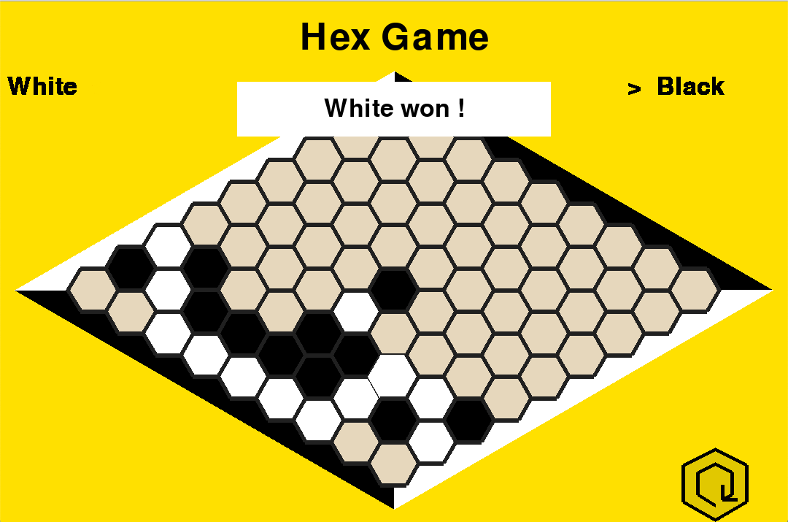
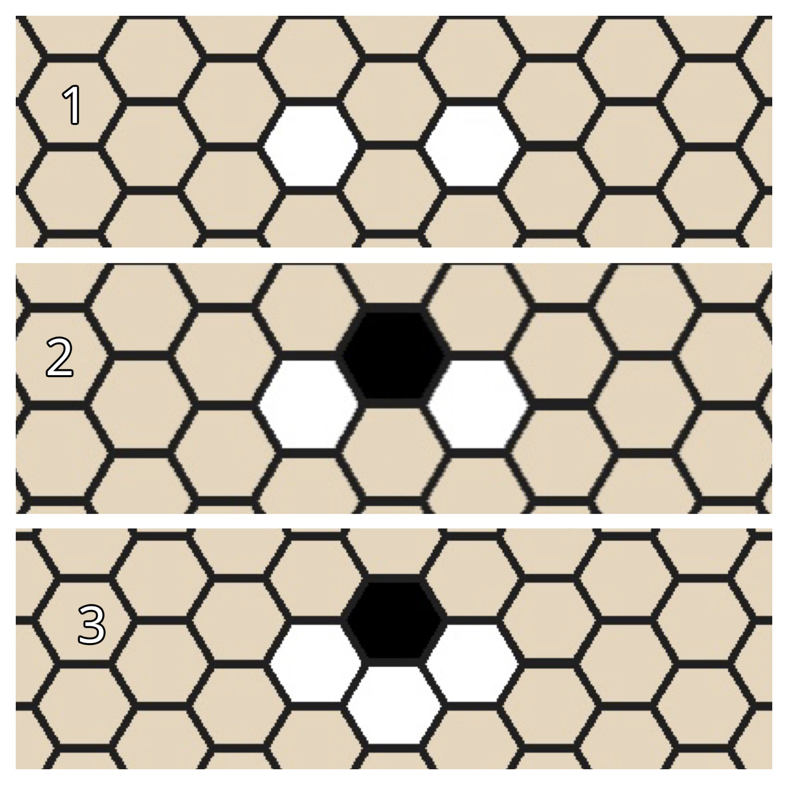
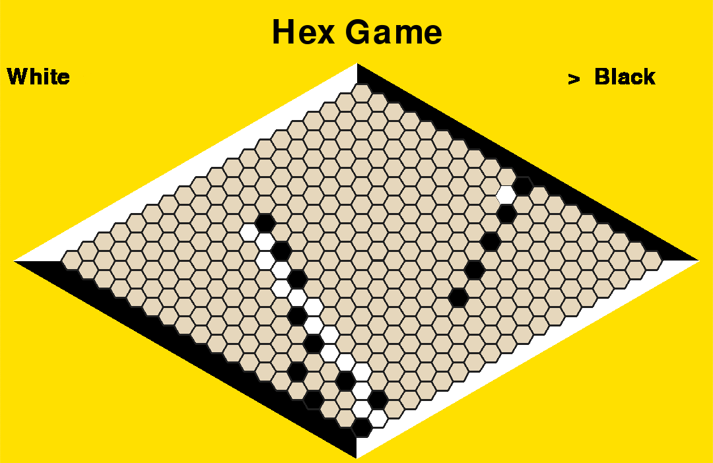
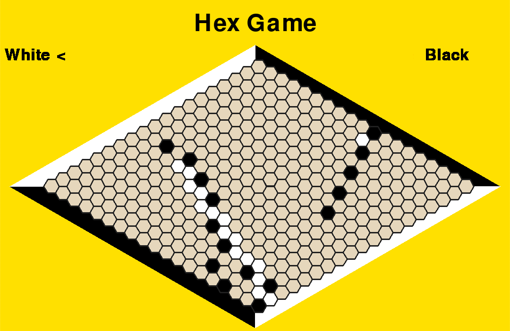
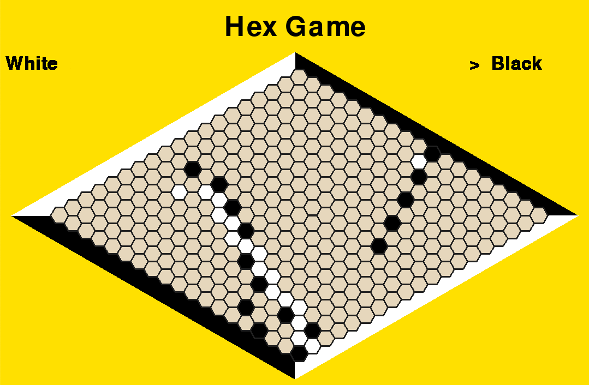
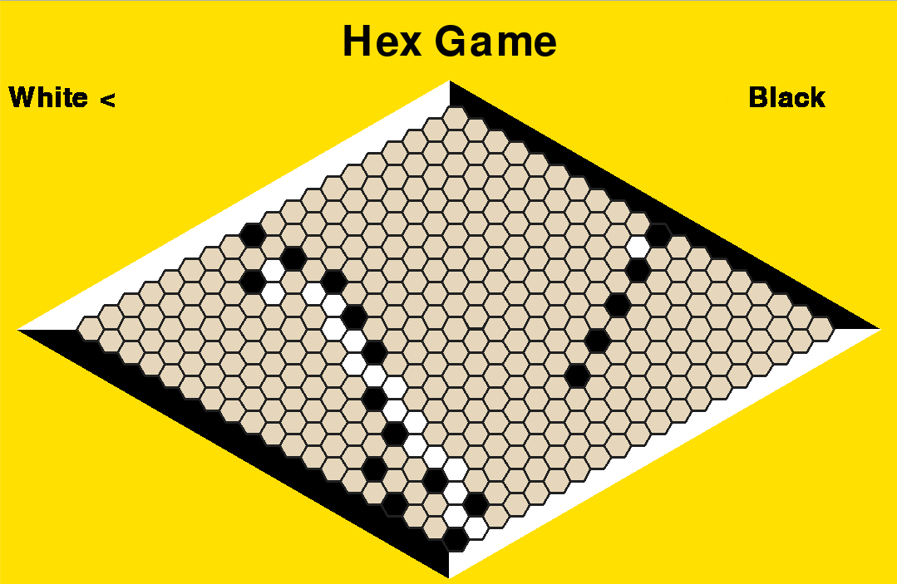
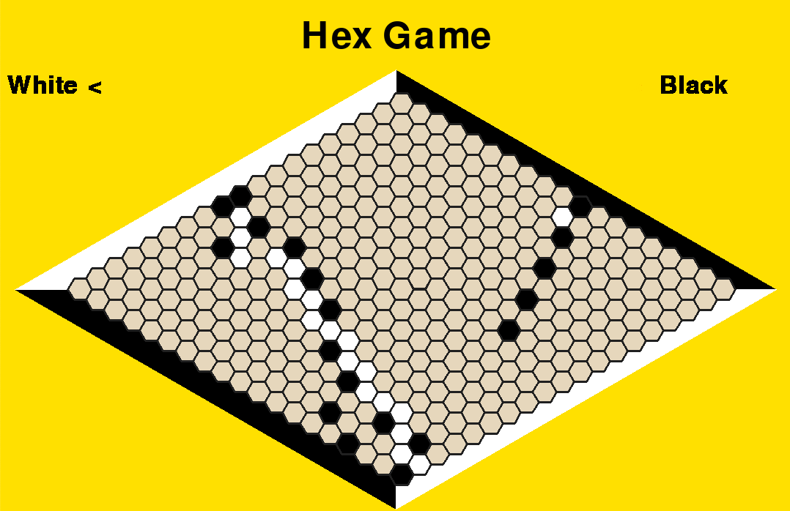
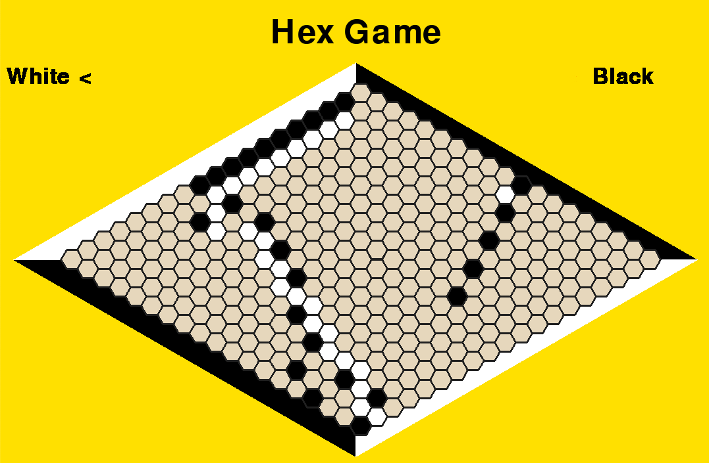

# Hex with Pygame
## Whats is Hex ?
-----
### Historical point of view
-----
Hex as been created in 1942 by a Danish mathematician named _Piet Hein_. The first commercialization of this game is in 1952. With time, some strategies to win have been seeking. Thus, techniques have been found to consistently win on a 7x7 and 9x9 Board. More recently, in 2019, Facebook succeeds in beating the best player of Hex on a 19x19 board.
### What Are the rules of this game ?
---
First, Hex is a two player game. It's a strategic and abstract board game. Each players have a color, black and white. The cells of the board are made up of hexagons. Hence the name "Hex".The goal for each player is to form a connected path of their stones linking the opposing sides of the board marked by their colors before their opponent similarly connects his or her sides.



_Illustration from the Game_

In this example, white won because they form a line that is linking the opposite white side. Traditionally, board measure 9x9, 11x11, 13x13 or 17x17. 

### Some Strategies and tips
---
#### **Easy and Faster connections**
Usually, beginners place their pawns directly next to them to create a connection. But there is a faster way to proceed. If you have 2 pawns that have 2 hexagons in common (1), they can be connected, even if black put a Hexagon in one of them (2) > (3). Example:


#### **Stopping a pawn**

Imagine playing black and being in this situation:



---

How can you stop white ?
First play a pawn in front of white's pawn.



---

Now white is obligate to play at the left if they want to win.



----
Now that you are in this position you must put white in a situation where they must play near your pion, by playing like that:


---
Now white as no option:


---
Last be not the least, play a pawn like the first time



---
And that's it ! You blocked them.



## The program
---
### The algorithm for the Win
---
How can the algorithm detect if a player has won ?

#### **Step 1:**
If there is a pawn on the first line, it would be marked as "solution pawn".
If there is no pawn on this line, then, the player can't win

#### **Step 2:**
All pawns connected to a solution Pawn becomes Solution pawn. But when a Solution Pawn makes a non-solution pawn to become a solution, then this pawn becomes "past". A past pawn can't be a solution pawn anymore.

#### **Step 3:**
If a solution pawn is on the last line, the player won.

</br>
</br>

This  algorithm can be similar to <a href="https://en.wikipedia.org/wiki/Mathematical_induction">_Mathematical induction_</a> (_"<a href="https://en.wikipedia.org/wiki/Mathematical_induction">Raisonnement par Récurrence</a>"_ in French) in Maths

### Other fonctionnalities
---
#### **Color**
You can customize the main color of this game. Just by pressing a button
#### **Languages**
There is many languages that are available. (French 🇫🇷 , English 🇺🇸 , Japan 🇯🇵 , Korean 🇰🇷 , and Greek 🇬🇷 )
#### **Sound/Music**
There is an default music made by the author. The volume of the music can be modified from 0.0% to 100.0%
#### **Lenght of the Board**
The Lenght of the board can go from 5x5 to 50x50

<br/>

# How to install Python and Pygame ?

## Install Python 
----
If Python is not installed on your computer (to verify that, you can do: "```python --version```" on a Terminal. If you don't know how to access a Terminal you can click here :<a href="https://www.ionos.com/help/email/troubleshooting-mail-basicmail-business/access-the-command-prompt-or-terminal/"> How to access a Terminal</a>) you can click on this link <a href="https://www.python.org/downloads/">Installing Python</a>, than click on "Download Python 3.X.X". After that, you can execute this File. A window should appear. At the bottom of the screen, there is a small box where it's written: "Add Python3.X to path". Check this box. After that, click on "Customize Installation". Check all the boxes if they aren't checked and click on "Next". Then, click on "Install". After that, you can close the window

## Install Pygame
---
If you want to check if Python is installed you can open a Terminal and write ```python --version```. Installing Pygame is not difficult. Now you need to open a Terminal if there is none open. And just type ```py -m pip install pygame```. It will take some time for being installed.

## Install Hex Game
---
To install Hex Game you need to download this project as a .zip, then you have to decompress it. After the installation and the decompression, you have to execute it by doing ```py main.py``` </br>
**⚠️** Make sure that you are in the good Folder when you do that. For example, if the file is on your Desktop you should do ```cd Desktop```. You don't understand what I just said? Path of a file in <a href="https://www.sony.com/electronics/support/articles/00015251">Windows</a> / <a href="https://www.switchingtomac.com/tutorials/osx/5-ways-to-reveal-the-path-of-a-file-on-macos/">Mac</a>. How to use CD: <a href="https://www.techwalla.com/articles/how-to-use-quotcdquot-command-in-command-prompt-window"> Here </a>(It's the same with Mac) **⚠️**